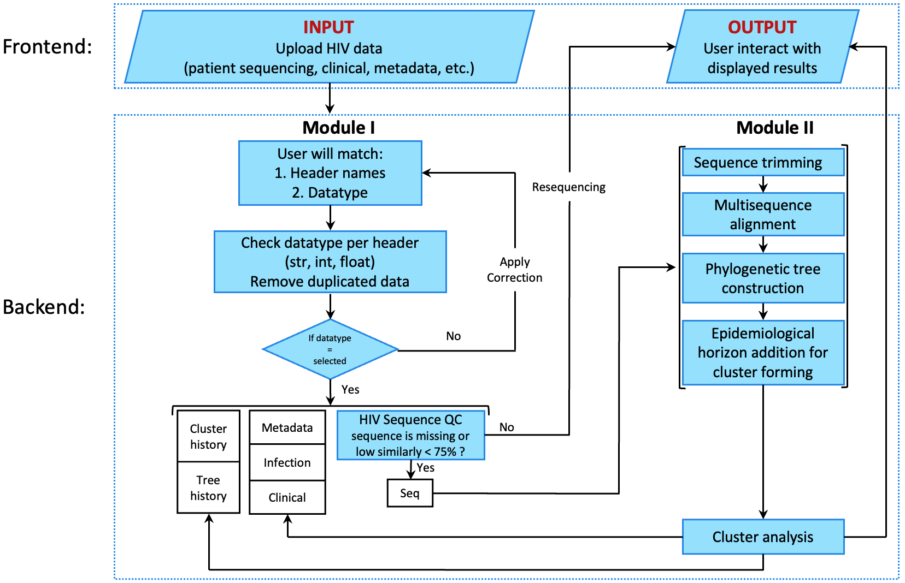

# Configuration Files

This directory contains configuration files for the project.

1. `extracting_seq_within_pol_region.py`: Python script to extract sequences within the pol region.
    - Algorithm workflow summary:
    
    
