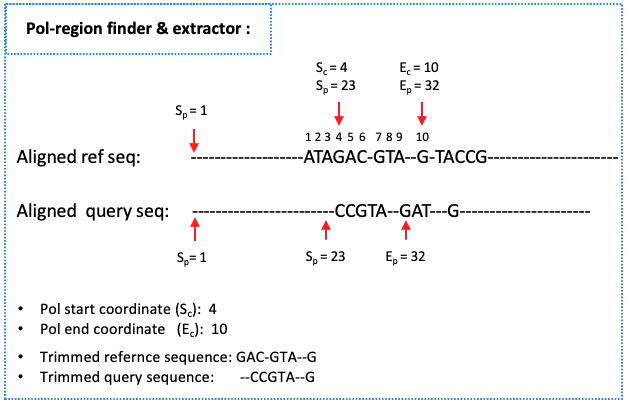

# Configuration Files

This directory contains configuration files for the project.

- `extracting_seq_within_pol_region.py`: Python script to extract sequences within the pol region.
    
    - Workflow summary of the `extracting_seq_within_pol_region.py` algorithm.
